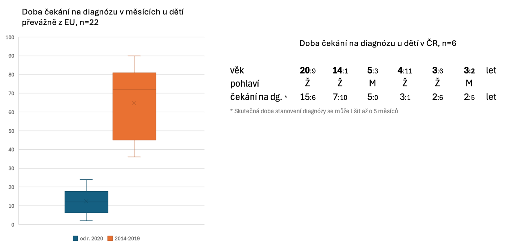

Příběhy pacientů se vzácným onemocněním často začínají nenápadnými, nespecifickými příznaky, které vedou k opakovaným návštěvám různých specialistů a dlouhému období nejistoty. Podle organizace EURORDIS trvá tzv. diagnostická odyssea – tedy cesta od prvních projevů až po stanovení konečné diagnózy – v průměru 5,4 roku u žen a 3,7 roku u mužů. [^https://www.eurordis.org/publications/rb-diagnosis-odyssey/]

**ADNP syndrom je vzácné neurovývojové onemocnění způsobené mutací v genu ADNP.** Patří mezi diagnózy, které jsou i přes závažnost svých projevů výrazně poddiagnostikovány. Gen ADNP kóduje protein nezbytný pro regulaci genové exprese a hraje klíčovou roli ve vývoji mozku. Porucha jeho funkce má zásadní dopad na neurologický vývoj dítěte. [^https://doi.org/10.1038/ng.2899]

Tento článek se zaměřuje na diagnostický proces a na vnímání ADNP syndromu z pohledu pečujících osob.

## Diagnostická odyssea se zkracuje

Na základě kvalitativní analýzy dat od 22 pečujících osob dětí s ADNP syndromem **byl identifikován významný rozdíl v délce diagnostického procesu mezi dětmi narozenými před rokem 2020 a po něm**. Přestože byl ADNP syndrom popsán již v roce 2014, děti narozené v letech 2014 až 2019 čekaly na stanovení diagnózy minimálně 36 měsíců. U dětí narozených po roce 2020 naopak v žádném z případů nepřesáhla doba do stanovení diagnózy 24 měsíců.

Podobný trend byl zaznamenán také v České republice, kde byla **mutace v genu ADNP diagnostikována u čtyř ze šesti dětí až po roce 2020**. U tří z těchto dětí byl potvrzen ADNP syndrom, v jednom případě se jedná o variantu s dosud nejasným klinickým významem. Tento vývoj odpovídá obecnému trendu u řady dalších vzácných onemocnění, kde pokrok v technologiích sekvenace DNA a snižování nákladů na genetická vyšetření významně zkracují dobu potřebnou k určení diagnózy. 

> Diagnostický proces u ADNP syndromu v České republice je však oproti evropskému průměru stále delší. Dosud se nepodařilo diagnostikovat žádného pacienta do 24 měsíců věku.

## Jak vnímají ADNP syndrom pečovatelé

Pro další analýzu byly děti rozděleny do dvou kohort podle věku: do první skupiny se zařadily děti do pěti let, do druhé všechny starší děti. Toto rozdělení odpovídá již zmíněnému předělu v diagnostice. **Délka diagnostické odyssey neprokázala statisticky významný rozdíl mezi pohlavími v žádné z kohort.** 

Zajímavé rozdíly se však objevily ve vnímání typických projevů ADNP syndromu v jednotlivých skupinách. U mladších dětí označilo **58 % pečujících osob** jako hlavní projev **celkové vývojové opoždění a autismus**. Naproti tomu ve starší skupině nikdo z pečovatelů neuváděl vývojové opoždění jako charakteristický znak a pouze 20 % pečujících osob zmínilo autistické projevy.

Naopak u faciálních abnormalit se objevil zrcadlově obrácený trend. **Zatímco u mladších dětí nikdo z pečovatelů nepovažoval odlišnosti v obličeji za signifikantní, u starších dětí je jako typický znak ADNP syndromu vnímala celá polovina pečujících osob.**

Nabízí se několik vysvětlení tohoto rozdílu. Opoždění psychomotorického vývoje je v raném dětství sledováno častěji a představuje oproti faciálním charakateristikám snadno rozpoznatelný projev. Po stanovení diagnózy pečovatelé obvykle získávají více informací o typických znacích syndromu a postupně se učí vnímat i jemnější projevy, které si dříve neuvědomovali. Zároveň se s vyšším věkem některé vývojové rozdíly mezi dětmi stírají, což může vést k tomu, že rodiče začínají věnovat větší pozornost specifickým fenotypickým rysům.

## Vývojové opoždění jako výchozí ukazatel

**Celkové vývojové opoždění bylo uvedeno jako dominantní indikační kritérium pro genetické vyšetření. Jako základní klinický projev jej uvedlo 63,6 % pečovatelů**, přičemž u 50,0 % těchto případů šlo zároveň o primární důvod pro genetické testování. Toto zjištění odpovídá dosud publikovaným studiím, které uvádějí, že **vývojové opoždění motoriky i řeči společně s intelektuálním postižením jsou přítomny u nejméně 96 % pacientů**.

Mezi dalšími faktory, které iniciovaly genetické vyšetření byla asfyxie, hypotonie a závažné zdravotní komplikace (např.: Fallotova tetralogie, chybějící ledvina či srdeční šelest). Tyto přidružené zdravotní problémy představují významné komorbidity ADNP syndromu a jejich přítomnost by měla vést lékaře k úvaze o možné genetické příčině.

## Závěr

Přestože je ADNP syndrom stále relativně nově popsanou genetickou poruchou, doba potřebná ke stanovení diagnózy se od roku 2020 zjevně výrazně zkrátila. Klíčovým faktorem je pravděpodobně rozvoj genetických technologií, zejména sekvenace nové generace (NGS), a zároveň postupné snižování nákladů na testování genetických panelů a celogenomové a exomové sekvenace (WES). Významnou roli sehrává i rostoucí povědomí o vzácných genetických onemocněních mezi lékaři primární péče.

V evropském kontextu se ukazuje, že celkové opoždění vývoje (motorika o řeč), je samo o sobě často dostatečným indikačním kritériem pro genetické vyšetření. Zároveň si rodiče starších dětí s odstupem přestávají spojovat opoždění vývoje jako hlavní charakteristiku ADNP syndromu a častěji si všímají jiných odlišností – například ve tváři dítěte oproti jeho vrstevníkům.

Při interpretaci prezentovaných zjištění je však třeba zohlednit několik limitujících faktorů. Především jde o relativně malý počet respondentů (n = 22), což může omezovat statistickou sílu a zobecnitelnost výsledků. Retrospektivní charakter dotazování představuje další možný zdroj zkreslení, protože pečující osoby odpovídaly na otázky týkající se událostí, které se odehrály před několika měsíci až lety, přičemž jejich vzpomínky mohly být ovlivněny pozdějšími zkušenostmi či informacemi získanými po stanovení diagnózy. Dále je třeba zmínit i selekční bias, neboť do výzkumu byly zařazeny pouze děti, u nichž již byla diagnóza ADNP syndromu potvrzena.

Navzdory těmto limitům přináší výsledky cenné poznatky o diagnostickém procesu ADNP syndromu a představuje odrazový můstek pro další, rozsáhlejší výzkumy v této oblasti.

### Popis sledovaného souboru

- 22 osob, z toho 14 chlapců a 8 dívek
- průměrný věk 7.0 roku, med 4.5, std 5.9, rozsah 1-19 let
- původ: 15 evropa, 2 usa, 1 asie, 4 neuvedena
